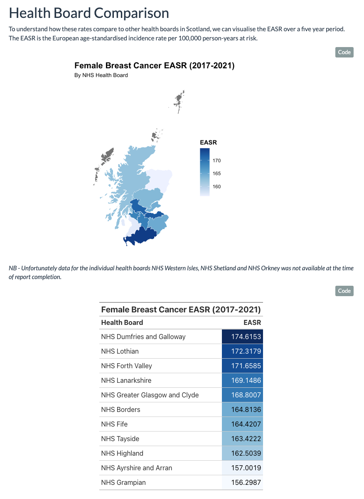
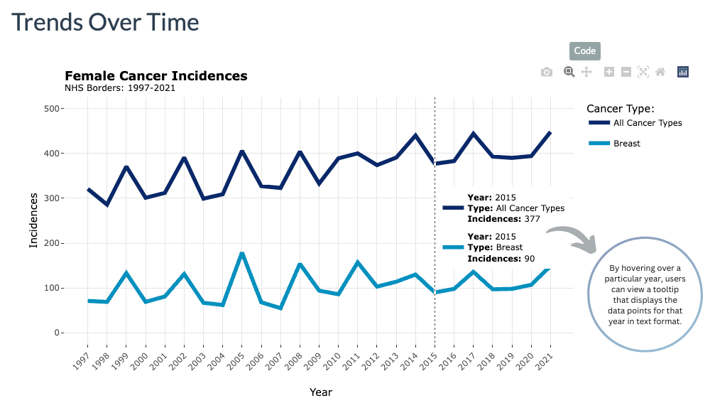

# Cancer Incidences: Report

[LINK TO REPORT HOSTED ON GITHUB PAGES](https://stenhousestuart.github.io/cancer_incidence_report/)

------------------------------------------------------------------------

## Introduction

The initial work for this project was completed in May 2023 as part of the
CodeClan Professional Data Analysis Course. Updates were made in July 2023.

*Disclaimer: This report has been written for the authors learning purposes only.*

------------------------------------------------------------------------

## Brief

To inform the planning and provision of cancer treatment services, analyse breast cancer incidence data from the NHS Borders health board. Findings should be presented in a report of 1-2 pages, highlighting any significant insights and identified trends.

------------------------------------------------------------------------

## Screenshots

------------------------------------------------------------------------

## Conclusions

- Screening data should be reviewed to establish if the resulting back-log from COVID-19 has been cleared in order to establish whether a further increase in incidences should be anticipated in 2022.

- Resources should be allocated according to the observed trend of increased incidences every three years

- Research/Analysis should be conducted to further understand and confirm any reason for this trend, including any links to screening schedules.

- Research/Analysis should be conducted to establish whether increased incidence with age is in any way the result of current screening criteria and if therefor screening criteria should be widened.

- Long term service planning should take into consideration the ~4% projected population increase of the female 50-70 demographic in NHS Borders, as projected by the National Records of Scotland.

------------------------------------------------------------------------

## Key Skills / Technologies Used

**Skills**

-   Exploratory Data Analysis
-   Data Visualisation
-   Geospatial Analysis
-   Hypothesis Testing
-   Data Wrangling
-   Data Cleaning

**Languages**

-   R
-   RMarkdown
-   HTML
-   CSS

**Packages**

- tidyverse
- infer
- plotly
- sf
- gt
- gtExtras
- janitor

**Technlogoies**

-   Git
-   GitHub

------------------------------------------------------------------------

